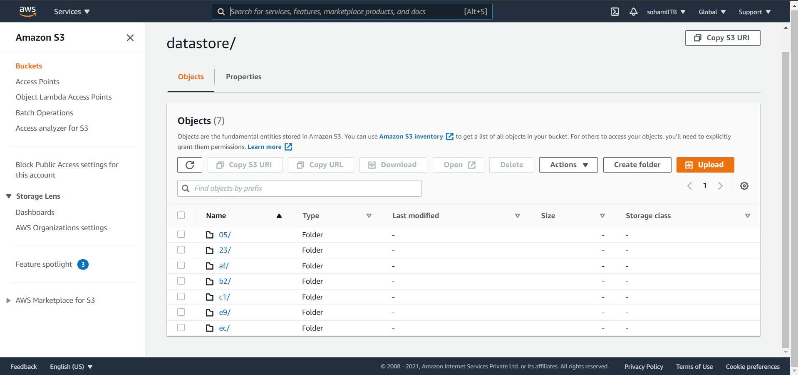

### Link to the repo
https://github.com/SohamIITBombay/MLOps_Assignment

### List of commands used
````mkdir MLOps_Assignment````<br>
````git init```` <br>
````git remote add origin https://github.com/SohamIITBombay/MLOps_Assignment```` <br>
````dvc init```` <br>
````git branch -M main```` <br>
````cd MLOps_Assignment````<br>
````mkdir data````<br>
````cd ..```` <br>
````mkdir external_cache```` <br>
````cd MLOps_Assignment```` <br>
````dvc add data/creditcard.csv```` <br>
````git add data/creditcard.csv.dvc data/.gitignore````<br>
````git commit -m "Add data"````<br>
````dvc remote add -d storage s3://creditcarddatabucket/datastore```` <br>
````git add .dvc/config```` <br>
````git commit -m "Configure remote"````<br>
````dvc push````<br>
````git push origin main````<br>

### Performance Metrics

#### DecisionTreeClassifier
- Accuracy: 99.95%
- f1 score: 0.8732

#### RandomForestClassifier
- Accuracy: 99.95%
- f1 score: 0.8691


### s3 bucket
